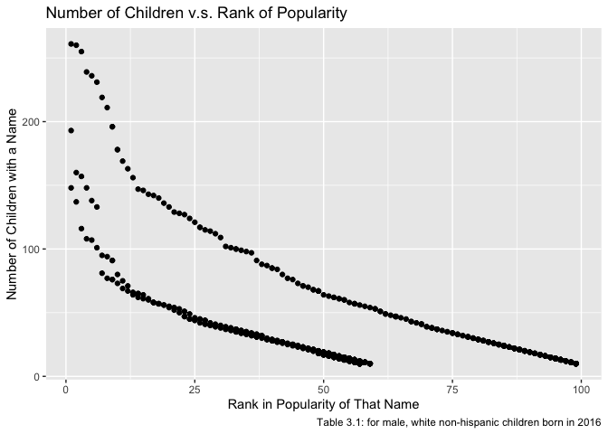

p8105\_hw2\_sl4655
================
Shuya Liu
October 2, 2019

*Problem 1*
===========

### Read and clean the Mr. Trash Wheel sheet

``` r
## Read in Mr. Trash Wheel data
trash_wheel_data <- 
  readxl::read_excel(path = "./data/Trash-Wheel-Collection-Totals-8-6-19.xlsx",
                     sheet = "Mr. Trash Wheel") %>%
  janitor::clean_names() %>%
  select(dumpster:homes_powered) %>%
  drop_na(dumpster) %>%
  mutate(sports_balls = round(sports_balls) %>% as.integer())
```

### Read and clean precipitation data for 2017 and 2018

``` r
precip_2017_data <- 
  readxl::read_excel(path = "./data/Trash-Wheel-Collection-Totals-8-6-19.xlsx",
                     sheet = "2017 Precipitation",
                     range = "A2:B14") %>%
  janitor::clean_names() %>%
  drop_na(total) %>%
  mutate(year = 2017)

precip_2018_data <-
  readxl::read_excel(path = "./data/Trash-Wheel-Collection-Totals-8-6-19.xlsx",
                     sheet = "2018 Precipitation",
                     range = "A2:B14") %>%
  janitor::clean_names() %>%
  drop_na(total) %>%
  mutate(year = 2018)
```

### Combine precipitation datasets

``` r
precip_combine_data <-
  rbind(precip_2017_data, precip_2018_data) %>%
  select(year, month, precipitation = total) %>% 
  mutate(month = factor(month, labels = month.name))
```

-   **For precipitation data**:

The dataset `precip_combine_data` contains 24 observations of 3 variables: year, month, precipitation. The total precipitation for year 2017 is 32.93(in). The total precipitation for year 2018 is 70.33(in). The difference between the total amount of the two years is 37.4(in). In year 2017, the smallest amount of precipitation 0(in) occurred in October, and the largest amount of precipitation 7.09(in) occurred in July. In year 2018, the smallest amount of precipitation 0.94(in) occurred in January, and the largest amount of precipitation 10.47(in) occurred in September.

-   **For Mr. Trash Wheel data**:

The dataset `trash_wheel_data` contains 344 observations of 14 variables: dumpster, month, year, date, weight\_tons, volume\_cubic\_yards, plastic\_bottles, polystyrene, cigarette\_butts, glass\_bottles, grocery\_bags, chip\_bags, sports\_balls, homes\_powered, with 0 missing data. The data starts from 2014-05-16 to 2019-06-17. To interpret the data, we take the first line as an example: on 2014-05-16, dumpster 1 collected 4.31 tons of trash with a volume of 18 cubic yards. These trash were consisted of 1450 plastic bottles, 1820 polystyrene, 1.2610^{5} cigarette butts, 72 glass bottles, 584 gorcery bags, 1162 chip bags, and 7 sports balls. And the trash generated powers for 0 homes. (Each ton of trash equates to on average 500 kilowatts of electricity. An average household will use 30 kilowatts per day.)

The medians of plastic\_bottles, polystyrene, cigarette\_butts, glass\_bottles, grocery\_bags, chip\_bags, sports\_balls for each year are shown as below:

    ##   year plastic_bottles polystyrene cigarette_butts glass_bottles
    ## 1 2014            1540        2075          100000          46.5
    ## 2 2015            1960        2570           34000          31.0
    ## 3 2016            2980        3720           38000          41.0
    ## 4 2017            2260        2330           13000          21.0
    ## 5 2018            1200        1020            7000           6.0
    ## 6 2019            1075        1350            4550           6.0
    ##   grocery_bags chip_bags sports_balls
    ## 1          796      1495          6.0
    ## 2         1340      1760         16.0
    ## 3         2210      2640         26.0
    ## 4         1950      2230          8.0
    ## 5          710      1200          4.0
    ## 6          650       790          8.5

The total amount of weight(tons), and volume(cubic\_yards), and homes powered for each year are shown as below:

    ##   year weight_tons volume_cubic_yards homes_powered
    ## 1 2014      141.35                669         0.000
    ## 2 2015      238.80               1103      2704.167
    ## 3 2016      164.59                816      2743.167
    ## 4 2017      174.84                885      2914.000
    ## 5 2018      310.39               1425      5173.167
    ## 6 2019       92.48                449      1541.333

*Problem 2*
===========

### Clean the data in pols-month.csv

``` r
pols_data <- 
  read_csv(file = "./data/fivethirtyeight_datasets/pols-month.csv") %>%
  janitor::clean_names() %>%
  separate(col = mon, into = c("year", "month", "day"), sep = "-") %>%
  mutate(month = factor(month, labels = month.name),
         president = factor(prez_gop, levels = c(0,1), labels = c("dem", "gop"))) %>%
  select(year:day, president, everything(), -prez_dem, -prez_gop, -day)
```

### Clean the data in snp.csv

``` r
snp_data <- 
  read_csv(file = "./data/fivethirtyeight_datasets/snp.csv") %>%
  janitor::clean_names() %>%
  mutate(date = as.Date(date, "%m / %d / %y")) %>%
  separate(col = date, into = c("year", "month", "day"), sep = "-") %>%
  mutate(month = factor(month, labels = month.name)) %>%
  select(year, month, snp_close = close) %>%
  arrange(year, month)
```

### Tidy the unemployment data

``` r
unemploy_data <- 
  read_csv(file = "./data/fivethirtyeight_datasets/unemployment.csv") %>%
  janitor::clean_names() %>%
  pivot_longer(
    jan:dec, 
    names_to = "month",
    values_to = "unemploy_rate") %>%
  mutate(month = 
           factor(month, 
                  levels = c("jan", "feb", "mar", "apr", "may", "jun", "jul", "aug", "sep", "oct", "nov", "dec"), 
                  labels = month.name),
         year = as.character(year))
```

### Join the datasets

``` r
## First merge snp into pols
join1_data <- left_join(pols_data, snp_data, by = c("year", "month"))

## Next merge unemployment into the result
result_data <- left_join(join1_data, unemploy_data, by = c("year", "month"))
```

**pols-month data**:

The dataset `pols_data` contains 822 observations of 9 variables, with 5 missing data, related related to the number of national politicians who are democratic or republican at any given time from 1947 to 2015:

-   The variable `president` contains two values: `dem` represents that the president was democratic on the associated date, and `gop` respresents that the president was republican on the associated date
-   The variables contain the names of `gov`, `sen`, `rep` represent the number of governers, senators, and representatives in each party on the associated date

**snp data**:

The dataset `snp_data` contains 787 observations of 3 variables, with 0 missing data, related to Standard & Poor’s stock market index from 1969 to 2068:

-   The variable `snp_close` represents the closing values of the S&P stock index

**umployment data**:

The dataset `unemploy_data` contains 816 observations of 3 variables, with 6 missing data, related to the precentage of umemployment in each month from 1948 to 2015:

-   The variable `unemploy_rate` represents the unemployment rate of the associated month

**resulting dataset**:

The dataset `result_data` contains 822 observations of 11 variables from 1947 to 2015, with 281 missing values. The variables are year, month, president, gov\_gop, sen\_gop, rep\_gop, gov\_dem, sen\_dem, rep\_dem, snp\_close, unemploy\_rate.

*Problem 3*
===========

### Load and tidy the data

``` r
name_data <- 
  read_csv(file = "./data/Popular_Baby_Names.csv") %>%
  janitor::clean_names() %>%
  distinct() %>%
  mutate(gender = str_to_lower(gender),
         ethnicity = str_to_lower(ethnicity),
         childs_first_name = str_to_title(childs_first_name),
         ethnicity = replace(ethnicity, ethnicity == "asian and paci", "asian and pacific islander"),
         ethnicity = replace(ethnicity, ethnicity == "black non hisp", "black non hispanic"),
         ethnicity = replace(ethnicity, ethnicity == "white non hisp", "white non hispanic")) %>%
  rename(year = year_of_birth)
```

Note that, although these data may seem fairly well formatted initially, the names of a categorical predictor and the case structure of string variables changed over time; you’ll need to address this in your data cleaning. Also, some rows seem duplicated, and these will need to be removed (hint: google something like “dplyr remove duplicate rows” to get started).

### Produce the rank in popularity of the name “Olivia”

``` r
subset(name_data, childs_first_name == "Olivia" & gender == "female") %>%
  select(year, ethnicity, rank) %>% 
  pivot_wider(names_from = "ethnicity",
              values_from = "rank") %>%
  kable(caption = "Table 3.1: Rank Popularity of 'Olivia'")
```

<table>
<caption>
Table 3.1: Rank Popularity of 'Olivia'
</caption>
<thead>
<tr>
<th style="text-align:right;">
year
</th>
<th style="text-align:right;">
asian and pacific islander
</th>
<th style="text-align:right;">
black non hispanic
</th>
<th style="text-align:right;">
hispanic
</th>
<th style="text-align:right;">
white non hispanic
</th>
</tr>
</thead>
<tbody>
<tr>
<td style="text-align:right;">
2016
</td>
<td style="text-align:right;">
1
</td>
<td style="text-align:right;">
8
</td>
<td style="text-align:right;">
13
</td>
<td style="text-align:right;">
1
</td>
</tr>
<tr>
<td style="text-align:right;">
2015
</td>
<td style="text-align:right;">
1
</td>
<td style="text-align:right;">
4
</td>
<td style="text-align:right;">
16
</td>
<td style="text-align:right;">
1
</td>
</tr>
<tr>
<td style="text-align:right;">
2014
</td>
<td style="text-align:right;">
1
</td>
<td style="text-align:right;">
8
</td>
<td style="text-align:right;">
16
</td>
<td style="text-align:right;">
1
</td>
</tr>
<tr>
<td style="text-align:right;">
2013
</td>
<td style="text-align:right;">
3
</td>
<td style="text-align:right;">
6
</td>
<td style="text-align:right;">
22
</td>
<td style="text-align:right;">
1
</td>
</tr>
<tr>
<td style="text-align:right;">
2012
</td>
<td style="text-align:right;">
3
</td>
<td style="text-align:right;">
8
</td>
<td style="text-align:right;">
22
</td>
<td style="text-align:right;">
4
</td>
</tr>
<tr>
<td style="text-align:right;">
2011
</td>
<td style="text-align:right;">
4
</td>
<td style="text-align:right;">
10
</td>
<td style="text-align:right;">
18
</td>
<td style="text-align:right;">
2
</td>
</tr>
</tbody>
</table>
### The most popular name among male children

``` r
subset(name_data, rank == 1 & gender == "male") %>%
  select(year, ethnicity, childs_first_name) %>% 
  pivot_wider(names_from = "ethnicity",
              values_from = "childs_first_name") %>%
  kable(caption = "Table 3.2: The Most Popular Name among Male Children")
```

<table>
<caption>
Table 3.2: The Most Popular Name among Male Children
</caption>
<thead>
<tr>
<th style="text-align:right;">
year
</th>
<th style="text-align:left;">
asian and pacific islander
</th>
<th style="text-align:left;">
black non hispanic
</th>
<th style="text-align:left;">
hispanic
</th>
<th style="text-align:left;">
white non hispanic
</th>
</tr>
</thead>
<tbody>
<tr>
<td style="text-align:right;">
2016
</td>
<td style="text-align:left;">
Ethan
</td>
<td style="text-align:left;">
Noah
</td>
<td style="text-align:left;">
Liam
</td>
<td style="text-align:left;">
Joseph
</td>
</tr>
<tr>
<td style="text-align:right;">
2015
</td>
<td style="text-align:left;">
Jayden
</td>
<td style="text-align:left;">
Noah
</td>
<td style="text-align:left;">
Liam
</td>
<td style="text-align:left;">
David
</td>
</tr>
<tr>
<td style="text-align:right;">
2014
</td>
<td style="text-align:left;">
Jayden
</td>
<td style="text-align:left;">
Ethan
</td>
<td style="text-align:left;">
Liam
</td>
<td style="text-align:left;">
Joseph
</td>
</tr>
<tr>
<td style="text-align:right;">
2013
</td>
<td style="text-align:left;">
Jayden
</td>
<td style="text-align:left;">
Ethan
</td>
<td style="text-align:left;">
Jayden
</td>
<td style="text-align:left;">
David
</td>
</tr>
<tr>
<td style="text-align:right;">
2012
</td>
<td style="text-align:left;">
Ryan
</td>
<td style="text-align:left;">
Jayden
</td>
<td style="text-align:left;">
Jayden
</td>
<td style="text-align:left;">
Joseph
</td>
</tr>
<tr>
<td style="text-align:right;">
2011
</td>
<td style="text-align:left;">
Ethan
</td>
<td style="text-align:left;">
Jayden
</td>
<td style="text-align:left;">
Jayden
</td>
<td style="text-align:left;">
Michael
</td>
</tr>
</tbody>
</table>
### Produce a scatter plot

``` r
subset(name_data, gender == "male" & year == "2016" & ethnicity != "hispanic") %>%  ## subset for male, white non-hispanic children born in 2016
  ggplot(aes(x = rank, y = count)) + 
  geom_point() + 
  labs(
    title = "Number of Children v.s. Rank of Popularity",
    y = "Number of Children with a Name",
    x = "Rank in Popularity of That Name",
    caption = "Table 3.1: for male, white non-hispanic children born in 2016")
```


